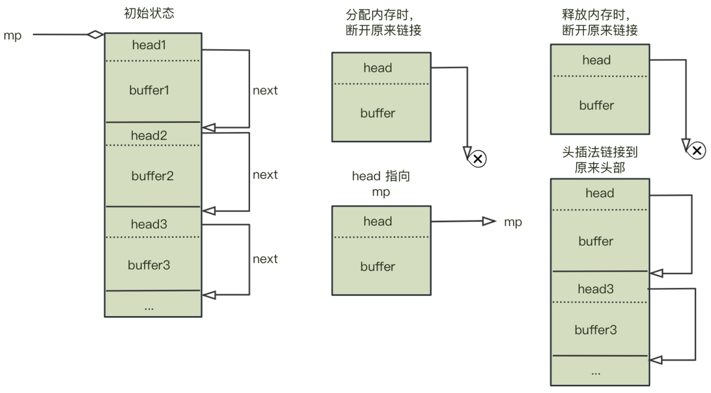

## `d`ead`l`ock `Checker`:死锁检查组件

**中文** ｜ [English](README_EN.md)  


## 1 前言

&emsp;&emsp;之前的检测组件由于数据结构设计不合理，每个线程都要维护其历史所获取的互斥锁，以便在后续算法处理中构建锁图，这是极其耗时的操作，另外所有工作线程产生的消息都传递到一个消息队列中，当线程数指数级增长时，会导致消费者线程 `checker` 无法及时处理消息，从而阻塞各生产者线程，严重影响执行效率。在实际测试中，将之移植到嵌入式开发的代码中使用，效果堪忧。本次版本升级，旨在改善这些问题，并提高工作效率。

### 1.1 之前的设计问题

- 1. 使用标准的内存分配接口，无法保证分配效率与并发性，加锁则可能导致检测出问题。
- 2. 数据结构设计不合理，需要单个线程维护历史加锁的链表。后续查表耗时。
- 3. 检测线程维护整个消息队列消耗较大，容易导致工作线程阻塞。
- 4. 自旋锁设计有问题，会导致概率性阻塞。
- 5. 检测算法不合理，由于使用拓扑排序算法，需要遍历所有的顶点才能识别出死锁环，算法时间复杂度高。

### 1.2 对应的修改

- 1. 使用内存池管理固定大小的内存使用，使用 `first fit` 算法管理不定大小的动态内存分配。
- 2. 重新设计数据结构，将锁图的顶点分为线程、锁两类，统一使用 `vertex_t` 类型表示，单个线程不再维护加锁链表。 
- 3. 每个线程维护一个消息队列，不再使用同一个消息队列，减少各个生产者线程之间的依赖。
- 4. 借鉴 `nginx` 自旋锁代码实现，重新设计自旋逻辑。
- 5. 更新检测算法，使用 `tarjan` 算法检测死锁，并记录请求锁的线程，仅检测在请求中的线程即可。降低时间复杂度。

### 1.3 其他改动

- 1. 不再使用事件机制检测是否自锁，`pthread` 接口是否使用错误等
- 2. 重新设计消息队列，使用单生产者-单消费者的无锁队列来实现。
- 3. 统一使用哈希表记录历史值，并用来查表，不再逐个遍历。

## 2 设计

### 2.1 构建有向图
&emsp;&emsp;考虑在一个由顶点 $V(t)$ 和边 $E(t)$ 组成的动态有向图$G(V(t), E(t))$ 中，其中：
    
1. $V(t)$ 和 $E(t)$ 分别表示在时刻 $t$ 的顶点和边的集合。其中 $V(t)$ 由 $T(t)$ 代表线程顶点，$M(t)$ 代表互斥锁顶点。  
2. 每条边 $e_i,_j$ 由三元组 $(v_i, s_m, v_j)$ 组成，其中 $v_i$, $v_j$ $\in V(t)$，$s_m \in \{request, held\}$ 表示当前锁的状态。若 $v_i \in T(t) $, $v_j \in M(t) $, $s_m$ 取值为 $requset$, 则 $(v_i, m_k, v_j)$ 表示线程 $t_i$ 在申请锁 $m_j$。若 $s_m$ 取值为 $held$ 则表示锁  $m_i$ 被 线程 $t_j$ 占有。


### 2.2 数据结构设计

#### 2.2.1 顶点定义

```c{.line-numbers}
enum vertexType{
    VERTEX_THREAD,
    VERTEX_MUTEX
};
typedef enum vertexType vertexType_t;

struct vertex{
    vertexType_t type;
    struct {
        short dfn;
        short low;

        bool inStack;
    };
    short indegree;
    short outdegree;

    arc_t *arcList;
    vertexOperation_t *ops;
    char private[0];
};

struct mutexInfo{
    size_t mid; /* mutex id */
};
typedef struct mutexInfo mutexInfo_t;

struct threadInfo{
    char name[SIZE_OF_NAME];
    long tc;    /*thread count.*/
    size_t tid; /* thread id */
    void *backtrace[DEPTH_BACKTRACE];
};
typedef struct threadInfo threadInfo_t;
```
&emsp;&emsp;其中 `private` 为顶点的私有信息，根据顶点的 `type`, 可选为线程或者互斥锁。

#### 2.2.2 边定义

```c{.line-numbers}
struct arc{
    struct vertex *tail;       //! pointer to the tail of a edge.
    struct arc *next;   
};
typedef struct arc arc_t;
```
&emsp;&emsp;其中，`tail` 指向边的尾端，即该顶点要指向的下个顶点，`next` 为以该顶点为首端出来的下一条边。

### 2.3 Tracker 实现
&emsp;&emsp;为了实现对互斥锁的加锁、解锁操作的追踪，可以对 `pthread` 的相关 `API` 进行封装，在调用前后插入追踪代码。并用封装后的接口替换原有接口，可利用链接选项的 `-Wl,--wrap=pthread_mutex_lock -Wl,--wrap=pthread_mutex_unlock` 实现。

&emsp;&emsp;这里给出 `Tracker` 的主要工作流程。

1. 互斥锁加锁操作`lock` 请求/获取逻辑

> 输入：线程标识符$t$、互斥锁标识符$m$
> 输出: 整型值，指示线程 $t$ 是否成功获取互斥锁 $m$.
> ① 设 $t$ 为当前线程标识符
> ② 设 $m$ 为当前互斥锁标识符
> ③ 记录当前线程的栈回溯等消息信息。
> ④ 向消息队列中插入request-lock消息
> ⑤ ret := native_mutex_lock($m$)
> ⑥ if ret == 0
> ⑦ 向消息队列中插入acquire-lock消息
> ⑧ end

2. 互斥锁解锁操作`unlock`释放逻辑

> 输入：线程标识符$t$、互斥锁标识符$m$
> 输出: 整型值，指示线程 $t$ 是否成功释放互斥锁 $m$.
> ① 设 $t$ 为当前线程标识符
> ② 设 $m$ 为当前互斥锁标识符
> ③ 记录当前线程的栈回溯等消息信息
> ④ ret := native_mutex_lock($m$)
> ⑤ if ret == 0
> ⑥ 向消息队列中插入release-lock消息
> ⑦ end

&emsp;&emsp;`Tracker` 所用到的部分重要定义如下：

- 消息队列中的元素定义
  
```c{.line-numbers}
enum eventType{
    EVENT_WAITLOCK,
    EVENT_HOLDLOCK,
    EVENT_RELEASELOCK,
    EVENT_BUTT
};
typedef enum eventType eventType_t;

struct event{
    eventType_t     type;
    threadInfo_t    threadInfo;
    mutexInfo_t     mutexInfo;
};
typedef struct event event_t;
```

### 2.4 Checker 实现

&emsp;&emsp;检测模块 `Checker` 根据 `Tracker` 发送的消息动态构建和更新互斥锁锁分配图，并负责检测其上是否有死锁环。实际上，检测模块被实现为一个驻留在目标程序进程空间的独立线程，它周期性地(比如 **1s**) 休眠和苏醒，以减少对目标程序不必要的干扰。当 `Checker` 苏醒时，它从每一个在其休眠期间执行过加锁解锁操作的线程的消息队列中读取消息，并根据这些消息更新锁分布图。

&emsp;&emsp;以下给出了 `Checker` 处理消息和更新图的整体过程，总体来讲仍是不断通过 $\textcolor{green}{add\ edge}$ 与 $\textcolor{red}{remove\ edge}$ 的操作以达到动态更新锁分布图的目的。

&emsp;&emsp;下面代码片段展示了 `Checker` 处理消息的整体流程

- 事件循环处理
```c{.line-numbers}
void eventLoopEnter(){
    eventQueue_t *eq;
    long loops = atomicThreadCounts;

    for (long i = 1; i <= loops; ++i) {
        eq = (eventQueue_t *)eventQueueMapGetLocked(eventQueueMap, (void *)i, &eventQueueMapLock);
        if(eq == NULL) continue;
        int num = eventQueueUsed(eq);

        while (num > 0) {
            event_t ev;
            assert(1 == eventQueueGet(eq, &ev));
            eventHandler(&ev);
            num--;
        }
    }
}
```
&emsp;&emsp;其中，`eventHandler` 为处理具体事件的接口，其内部会根据事件类型进行有向图的更新操作。

- checker 工作线程

```c{.line-numbers}
 while (1) {
        //! process all event.
        eventLoopEnter();

        now = timeInMilliseconds();
        diff = now - pre;
        dlc_dbg("diff %lld\n", diff);
        if (diff >= PERIOD_OF_DLCHECKER) {
            strongConnectedComponent();
            pre = now;
        } else {
            usleep((PERIOD_OF_DLCHECKER - diff) * 1000);
        }
    }
```
&emsp;&emsp;`Checker` 实现为一个后台线程，一直处理事件，并在预设的特点时间内执行检测操作，其中 `strongConnectedComponent` 接口为死锁检测入口，其内部调用 `tarjan` 算法检测环是否存在，如果有环，则会输出报告信息。`tarjan` 算法的实现思路可自行查阅资料。

### 2.5 内存管理

&emsp;&emsp;本次内存管理统一使用内存池或动态内存分配进行管理。其中基于功能设计将内存大小固定的内存分配划归内存池管理，将内存大小不固定的内存划为动态内存管理。

&emsp;&emsp;划归内存池管理的内存包括 `vertex_t` 类型的顶点(包括其私有信息，即 `mutexInfo_t` 以及 `threadInfo_t`)，`arc_t` 类型的边，`eventQueue_t` 类型的每个线程的专属队列以及队列的 `buffer`; 划归动态内存管理的内存有 `hashMap_t` 类型的哈希表结构，`entry_t` 类型的哈希表里面的桶结构，以及 `memPool_t` 类型的内存池管理结构。

#### 2.5.1 内存池的实现

&emsp;&emsp;内存池的设计思路为将一块内存平均划分为固定大小的小块内存，相邻内存间采用单向链表链接，申请时优先申请链表里的第一个内存块，释放时采用头插法，将回收的内存块挂载到链表头部。



&emsp;&emsp;需要注意的是，每个分配出去的内存块真正使用的内存是去除`head` 所在内存的剩余内存，`head` 实际存放的是下一个内存块的首地址。在申请内存时，`head`由原来的指向下一个内存块转而指向内存池管理结构，这样才能再回收时定位到当前的头部节点，以便利用头插法回收内存。

#### 2.5.2 动态内存分配的实现

&emsp;&emsp;动态内存分配采用嵌入式`RTOS`中常用的 `first fit` 算法管理内存，内部采用双向链表链接前后的空闲内存块，内部实现较为巧妙。具体实现方式可查阅 `RT-Thread` 与 `FreeRTOS` 相关源码。

#### 2.5.3 自定义内存段

&emsp;&emsp;本次内存管理所需的总内存，通过在 `.bss` 段与 `.data` 之间自定义内存池与堆内存段实现。即自定义两个 `section`, 分别用于内存池内存与小内存动态堆使用。

&emsp;&emsp;具体细节可通过自定义链接脚本实现自定义 `section`，也可以直接使用编译属性实现。效果为:

```bash
 24 .data         00000010  00000000006030c8  00000000006030c8  000030c8  2**3
                  CONTENTS, ALLOC, LOAD, DATA
 25 .dlc.heap     00100000  00000000006030d8  00000000006030d8  000030d8  2**0
                  ALLOC
 26 .dlc.mempool  01000000  00000000007030d8  00000000007030d8  000030d8  2**0
                  ALLOC
 27 .bss          000001a8  00000000017030e0  00000000017030e0  000030d8  2**5
```

&emsp;&emsp;其中，`.dlc.heap` 用于小内存堆使用，大小为 **1MB**； `.dlc.mempool` 用于内存池使用，大小为 **16MB**。 

&emsp;&emsp;链接脚本为：

```bash
__DLC_HEAP_SIZE = 0x100000;

SECTIONS {
 .dlc.heap : {
  _dlc_heap_start = .;
  . = ALIGN(4);

  . += __DLC_HEAP_SIZE;
  
  . = ALIGN(4);
  _dlc_heap_end = .;
 }

 PROVIDE(__DLC_HEAP_START = _dlc_heap_start);
 PROVIDE(__DLC_HEAP_END = _dlc_heap_end);
}

__DLC_MEMPOOL_SIZE = 0x1000000;
SECTIONS {
 .dlc.mempool : {
  _dlc_mempool_start = .;
  . = ALIGN(4);

  . += __DLC_MEMPOOL_SIZE;
  
  . = ALIGN(4);
  _dlc_mempool_end = .;
 }

 PROVIDE(__DLC_MEMPOOL_START = _dlc_mempool_start);
 PROVIDE(__DLC_MEMPOOL_END = _dlc_mempool_end);
}

INSERT BEFORE .bss;  
```

#### 2.5.3 内存统计

&emsp;&emsp;源码中加入内存统计模块，用以统计运行过程中的内存消耗，包括可用内存，最大消耗内存、平均消耗内存等。实现方法为在内存池与小内存分配模块中加入对应统计字段，每次分配、释放内存时更新统计值。

```c
int32_t err;    //！内存分配错误次数
int32_t avail;  //！当前可用内存
int32_t used;   //！当前已使用内存
int32_t max;    //！已使用内存峰值
```

## 3 测试用例

&emsp;&emsp;本次测试代码使用 `valgrind` 里的示例程序，即实现一个典型的死锁程序——哲学家吃饭问题，使用该程序构建死锁，并检测之。

&emsp;&emsp;源代码为

```c{.line-numbers}
#include <pthread.h>
#include <stdlib.h>
#include <unistd.h>

#define NUMBER_OF_PHILOSOPHERS  5
/* Naive dining philosophers with inconsistent lock acquisition
   ordering. */
static pthread_t phil[NUMBER_OF_PHILOSOPHERS];
static pthread_mutex_t chop[NUMBER_OF_PHILOSOPHERS];

void* dine ( void* arg )
{
   int i;
   long left = (long)arg;
   long right = (left + 1) % NUMBER_OF_PHILOSOPHERS;
   for (i = 0; i < 1000/*arbitrary*/; i++) {
      pthread_mutex_lock(&chop[left]);
      pthread_mutex_lock(&chop[right]);
      /* eating */
      pthread_mutex_unlock(&chop[right]);
      pthread_mutex_unlock(&chop[left]);

      // usleep(40 * 1000);
   }
   return NULL;
}

int main ( void )
{
   long i;
   for (i = 0; i < NUMBER_OF_PHILOSOPHERS; i++)
      pthread_mutex_init( &chop[i], NULL);

   for (i = 0; i < NUMBER_OF_PHILOSOPHERS; i++)
      pthread_create(&phil[i], NULL, dine, (void*)i );

   for (i = 0; i < NUMBER_OF_PHILOSOPHERS; i++)
      pthread_join(phil[i], NULL);
   return 0;
}
```

&emsp;&emsp;在代码中使用死锁检测，需要在线程创建之前调用接口 `initDeadlockChecker(0)`, 入参为打印级别, 然后编译时链接进提供的动态库即可。

&emsp;&emsp;检测结果为:

```log
----------------find ssc 0: 10 vertexs...----------------
==1231== [!!!Warnning!!!] Unlocked mutex possibly held by other thread...
==1231== Thread # [17211 test]:
==1231==         holds the lock #0xaaaae9cfb1b0 [0xaaaae9ce17ec 0xaaaae9ce1550 0xaaaae9ce136c 0xffffb03ad5c8 0xffffb0415d9c]
==1231== Thread # [17212 test]:
==1231==         waits the lock #0xaaaae9cfb1b0 [0xaaaae9ce17ec 0xaaaae9ce1550 0xaaaae9ce136c 0xffffb03ad5c8 0xffffb0415d9c]
==1231== Thread # [17212 test]:
==1231==         holds the lock #0xaaaae9cfb1e0 [0xaaaae9ce17ec 0xaaaae9ce1550 0xaaaae9ce136c 0xffffb03ad5c8 0xffffb0415d9c]
==1231== Thread # [17213 test]:
==1231==         waits the lock #0xaaaae9cfb1e0 [0xaaaae9ce17ec 0xaaaae9ce1550 0xaaaae9ce136c 0xffffb03ad5c8 0xffffb0415d9c]
==1231== Thread # [17213 test]:
==1231==         holds the lock #0xaaaae9cfb210 [0xaaaae9ce17ec 0xaaaae9ce1550 0xaaaae9ce136c 0xffffb03ad5c8 0xffffb0415d9c]
==1231== Thread # [17214 test]:
==1231==         waits the lock #0xaaaae9cfb210 [0xaaaae9ce17ec 0xaaaae9ce1550 0xaaaae9ce136c 0xffffb03ad5c8 0xffffb0415d9c]
==1231== Thread # [17214 test]:
==1231==         holds the lock #0xaaaae9cfb150 [0xaaaae9ce17ec 0xaaaae9ce1550 0xaaaae9ce136c 0xffffb03ad5c8 0xffffb0415d9c]
==1231== Thread # [17210 test]:
==1231==         waits the lock #0xaaaae9cfb150 [0xaaaae9ce17ec 0xaaaae9ce1550 0xaaaae9ce136c 0xffffb03ad5c8 0xffffb0415d9c]
==1231== Thread # [17210 test]:
==1231==         holds the lock #0xaaaae9cfb180 [0xaaaae9ce17ec 0xaaaae9ce1550 0xaaaae9ce136c 0xffffb03ad5c8 0xffffb0415d9c]
==1231== Thread # [17211 test]:
==1231==         waits the lock #0xaaaae9cfb180 [0xaaaae9ce17ec 0xaaaae9ce1550 0xaaaae9ce136c 0xffffb03ad5c8 0xffffb0415d9c]
```

&emsp;&emsp;显然这里有五个线程构成了死锁环。即相邻线程间链式持有对方申请的锁，直至 `T(25130)`首尾形成了闭环。 

```zsh
T(17210) <-- T(17211) <-- T(17212) <-- T(17213) <-- T(17214) <-- T(17210)
```
&emsp;&emsp; `T1 <-- T2` 表示 线程 `T1` 持有线程 `T2` 准备申请的锁🔒。

## 4 内存消耗

&emsp;&emsp;如小节 2.5.3 所述，本次设计所用内存全部皆由内存管理模块负责分配与释放，所以实际消耗内存为 `16 + 1 = 17 MB`，然而这个是内存的最大容量，而非组件实际消耗。内存的容量按照线程个数的最大来设计，而根据线程个数与锁的个数不同，实际消耗要具体分析。总的来讲，`17 M` 满足了 `512` 个线程个数与 `1024` 个锁个数的内存使用。

## 5 问题汇总

1. 使用原子变量记录线程总个数时，并发没做好导致数据竞争，使得线程的队列分配概率性出现重复。
2. 哈希表内部使用 `malloc` 分配内存，可能引入并发问题。
3. 更新锁图时，以为同一时刻，单个线程只能获取一把锁，一把锁只能被一个线程持有，所以为简化代码，固定每个顶点只有一个边，导致概率性检测失败。根因在于每个线程都有其对应的专属队列，所有加解锁的顺序并非是全局有序的。因此每个顶点并非只能有一个边。比如 `线程1` 实际已经释放了 `锁1` ，但是由于后台线程处理事件时还没处理到释放事件，此时 `线程2` 占有了 `锁1` ，后台线程正好处理到此占据事件，就会导致此时 `锁1` 有两个出边。
4. 使用头插法操作链表时，由于加入了 `dummy` 节点，之后操作基于 `dummy` 节点，删除边时，如果删除的是 `head` 节点，只是将 `dummy.next` 置空，而使得实际的 `u.arcList` 指向没变化，形成了悬垂指针引用。

## 6 进一步计划
1. 功能扩展。当前版本只支持检测互斥锁自锁与死锁，不支持其它同步与互斥语义导致的死锁，也不支持接口错用的检查等，相应功能的添加可以参考 `helgrind`。
2. 资源回收。当前版本没有对线程资源进行清理，如果应用程序存在大量线程资源的申请释放，会导致大量资源驻留。这个后续可以加入资源管理模块进行定时清理。
3. 性能优化。由于目前使用单消费者线程进行所有生产者线程的事件处理，线程数增长到一定个数时，后台处理效率会不太理想，导致拖慢应用程序的执行效率。这个改进的方向可以是简化事件处理，比如可以考虑合并多个事件，即 `申请-->占据-->释放` 三个事件可以组合起来处理，不必依次处理等; 亦可以增加后台处理线程个数，提高处理效率等；当然优化锁图的构建模型，重新设计检测效率更高的算法也是一个方向。
   